## Background

The *Flora of Australia* project on the Atlas of Living Australia's (ALA) 'Profiles' platform (eFlora platform) builds taxon profiles by aggregating information from a number of online resources, such as the *National Species List* (NSL) and *Australasian Virtual Herbarium* (AVH). Keys are sourced from *KeyBase*, an online repository and platform for storing, managing and deploying dichotomous identification keys.

Because the *Flora of Australia* uses an aggregation model, some *Flora* content needs to be edited in its source repository rather than inline within the *Flora* itself. For this reason, contributors to the *Flora* need to be familiar with accessing and managing keys directly in KeyBase. These *User Guidelines* provide:

-   an overview of KeyBase, its use, and its relationship to the *Flora of Australia*

-   instructions on managing keys in KeyBase, and

-   some worked examples to illustrate best practice in writing and managing KeyBase keys.

The *Guidelines* assume that you are familiar with standard dichotomous identification keys, the standard keys usually printed in Floras and used throughout the *Flora of Australia* series.

## KeyBase -- teaching old keys new tricks

KeyBase (<http://keybase.rbg.vic.gov.au/>) is an online repository and platform for storing, managing and deploying dichotomous identification keys. KeyBase's motto -- *teaching old keys new tricks* -- refers to the range of features and options that KeyBase offers compared with traditional, printed keys. For example, keys managed in KeyBase are automatically linked into taxonomic chains (e.g. a key to families linking to a key to genera linking to a key to species linking to a key to subspecies), allowing users to readily navigate among and between keys; and KeyBase keys can be filtered on-the-fly, either locally (within a single key) or globally (within all the keys of a project).

KeyBase keys are arranged into projects. A project is a group of keys related to a specific taxonomic group (e.g. flowering plants) in a given geographic area (e.g. Australia). Linking and filtering of keys happens within a project. For the purpose of these *Guidelines*, the most relevant project is the *Flowering Plants of Australia* project (<http://keybase.rbg.vic.gov.au/projects/show/1>). Other projects that may be relevant are Australian state-based projects (e.g. *Flora of New South Wales*, *Flora of Victoria*, *Flowering Plants of Queensland*, *Flowering Plants of Western Australia* etc.). Each Flora project on the ALA's eFlora platform will be linked to a project in KeyBase. The *Flora of Australia* links to KeyBase's *Flowering Plants of Australia* project and sources its keys from there. All other KeyBase projects are invisible from within the *Flora of Australia*.

A sandbox project for these *Guidelines* has been established at <http://keybase.rbg.vic.gov.au/projects/show/28>. Use this project to experiment freely with KeyBase. At regular intervals the sandbox will be reset, so there is no danger of compromising a real project while experimenting in the sandbox.

> Note that you need to be a registered user of KeyBase, and a registered contributor to the sandbox, before you can experiment in it. See the section *Registering for KeyBase, and becoming a Contributor* below for instructions on how to do this.

## Using keys in KeyBase

Keys from the *Flowering Plants of Australia* project are accessible from within the *Flora of Australia* using a KeyBase plug-in. They are also all accessible directly via KeyBase. This section of the *Guidelines* provides a brief introduction and tutorial to using KeyBase directly. The next section covers the management of keys within the *Flora of Australia* project.

#### Finding keys in KeyBase

Any key in KeyBase can be accessed from the Search box at the top right of the menu bar:


1. Type a taxon name (e.g. Acanthaceae) into the search box and click the Search button (or hit Enter).

> Note that KeyBase only searches the metadata of keys, not the taxa within them. If you search for a species (e.g. *Acanthus mollis*) within a key, no keys will be found (unless that species has a key to infra-species).

If the search is successful, KeyBase will list all keys found for the search term, arranged in their projects:

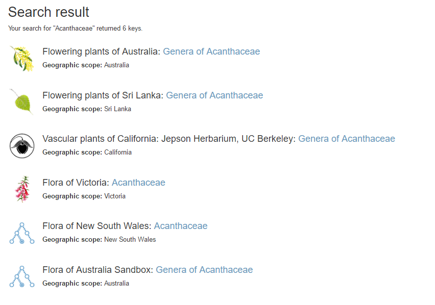

2. Click on [Genera of Acanthaceae](http://keybase.rbg.vic.gov.au/keys/show/905) in the *Flowering Plants of Australia* project, and KeyBase will take you to that key.

#### Using KeyBase keys

By default, KeyBase will open the key in the 'Interactive' view (the Key Player):

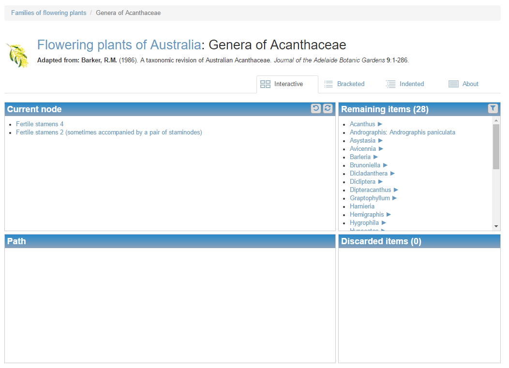

This page is divided into four boxes: *Current node*, *Path*, *Remaining items*, and *Discarded items*.

At the top of the key is a small breadcrumb trail, a series of hyperlinks that allows you to navigate up the chain of keys for progressively higher-level taxa (for example, from a key to species in a genus to the key to genera in the family to which the current key belongs, etc.). Below that is the title of the key and a reference to the key's source.

In the Player, you operate the key by choosing and clicking on relevant leads in the *Current node* box. As you click through the leads, KeyBase will respond by moving taxa from *Remaining items* to *Discarded items*. When one item (taxon) remains, the identification is complete.

*Path* shows each step you have taken as you proceed through the key. At any time you can backtrack by clicking on a previously-chosen lead in *Path*, or clicking the *Step back* button  located at top right of the *Current node* box. To restart the key completely, click the *Start over* button  also located at top right of that box.

In *Remaining items*, taxa that have linked keys are annotated with a forward arrow:

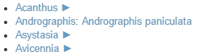

Click on the forward arrow and KeyBase will take you to the linked key for that taxon.

> Note that in the example above, *Andrographis* has no linked key, and is followed by a species name. In this case, *Andrographis* is a monotypic genus in Australia, so the key ends with the species name. The mechanism for doing this is dealt with in the section *Dealing with monotypic taxa or lower-level taxa in keys*, below.

The four tabs along the top of the key allow you to view the key in the Player and as bracketed and indented keys, and provide access to information about the key.

> Note that in bracketed view the go-to numbers at the end of a lead are hyperlinked and will navigate to the appropriate couplet. In both views, linked keys are accessed in the same way as in the Player.

#### Key metadata

The *About* tab provides the following information:

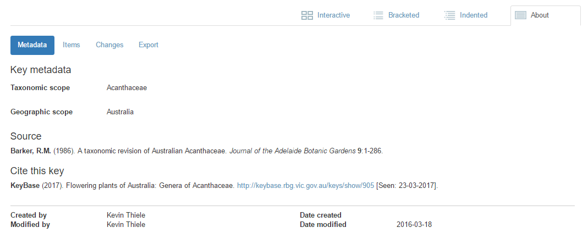

*Metadata* shows core metadata about the key such as its taxonomic and geographic scope, source, creation and last modification date, etc.

*Items* lists the taxa in the current key, for ready reference. *Changes* lists all modifications that have been made to the key since it was uploaded. *Export* allows the key to be downloaded in a variety of formats:

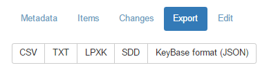

-   CSV is *Comma-Separated Values* format, a common format for e.g. uploading into MS-Excel

-   TXT is *Tab-separated Text* format, useful for editing a key in MS-Word or any text editor

-   LPXK format is a *Lucid Phoenix* native format. *Lucid Phoenix* (<http://www.lucidcentral.com/en-us/software/lucidphoenix.aspx>) is a program for editing and maintaining dichotomous keys, available from Identic Pty Ltd (<http://www.lucidcentral.com/en-us/software/services.aspx>).

-   SDD is the *Structured Descriptive Data* format maintained by *Biodiversity Information Standards (TDWG)*. See <http://www.tdwg.org/standards/> for more information

-   KeyBase (JSON) format uses a widely-used computer-readable standard format, suitable for programmers.

> **Note that any user may freely download any key from KeyBase.**

#### Editing keys in KeyBase

If you are a registered contributor to the *Flowering Plants of Australia* project and are logged in, a fifth tab, *Edit*, will allow you to edit the key's metadata, re-upload the key etc. (see the section *Managing keys in KeyBase,* below, for more information).

#### Filtering KeyBase keys

The *Filter* button on the Player, at the top right of the *Remaining items* box (), provides one of two ways of filtering a KeyBase key. Click this button and a dialog box will appear with two lists.

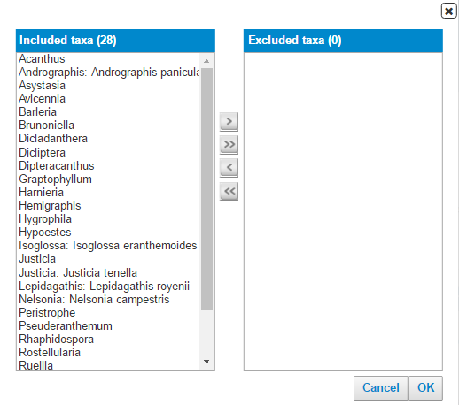

Use the buttons between the lists to exclude or include taxa from the key:

-   Clicking the single arrow will move currently selected taxa; clicking on the double arrow will move all taxa across.

-   Selecting one taxon and then pressing 'Shift' as you select another will include these two taxa and all others between them. Alternatively, click once on a taxon and the cursor can be dragged down or up to highlight other taxa.

-   Selecting one taxon and then pressing 'Ctrl' as you select others will allow you to select a set of non-contiguous taxa.

If you exclude some taxa then click OK, the key will be filtered to include only the included taxa.

This filter function in KeyBase filters a single key, resulting in a key that includes only a subset of taxa compared with the original key. KeyBase can also globally filter all the keys in a project, so that an entire project includes only a subset of taxa while the filter is in effect. This is useful, for example, if a user needs to identify a set of specimens collected in a survey locality. If the user has a listing of all taxa that are known to occur at or near the locality (derived from e.g. the *Australasian Virtual Herbarium*), a filtered project that includes only those taxa provides a substantially easier identification tool for those specimens.

Global filters are accessed via the *Filters* menu at the top of any KeyBase page. The *Filters* page provides access to the global filters function:

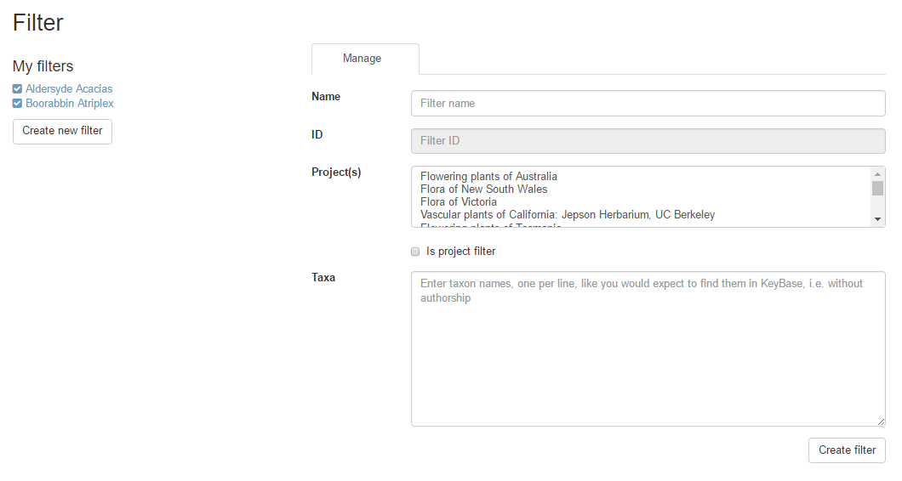

If you are a registered user of KeyBase, are logged in, and have previously created one or more filters while logged in, these will be listed under *My filters*. All filters created by logged-in users are saved for future use, allowing a filter to be used in multiple sessions.

> Note that users who are not registered or logged in can still create filters, but these will not persist after they leave KeyBase.

A filter is created using the fields on the right of the page:

1.  Enter a name for the filter (the name should be meaningful for you, as it will appear under your *My filters* list later if you are logged in);

2.  Choose one or more projects that you wish to filter (use shift- or control-click to choose multiple projects);

3.  Paste the list of taxa (you have obtained from elsewhere[^1]) into the *Taxa* box. Note that items in this list must be taxon strings exactly as they appear in KeyBase keys (e.g. "Eucalyptus camaldulensis" rather than "E. camaldulensis" or "Eucalyptus camadulensis Dehnh.");

4.  Click *Create filter*.

KeyBase will filter all keys, including top-level keys (e.g. the Key to Families), determining which families and genera need to be retained in the high-level keys from the species pasted into your list. A listing of all available keys in the filtered project(s) will be presented. Click on any key to start it.

> Note that when a global filter is in effect, the *Filter* button at the top right of *Remaining Items* will be yellow, and a *Delete* button will be available. Click the *Delete* button to remove the filter. Click the *Filter* button to change or modify the filter. The filter will remain in effect, and every key will be filtered, until you remove it or end the session.

## Managing keys for the *Flora of Australia* project in KeyBase.

All keys in the *Flowering Plants of Australia* project, and only keys in that project, are accessible to the *Flora of Australia* in the ALA's eFlora platform.

If you are editing a family or genus for the *Flora of Australia* and there is no key available in the project (you can check this by searching for the family or genus in the search box), you will need to write (or obtain from another source) and upload a key.

If there is a key in the *Flowering Plants of Australia* project, you may need to edit it to e.g. include new taxa described since the key was uploaded, to correct errors, or to improve the key in other ways.

In either case, you will need to be (1) a registered KeyBase user, and (2) a designated Contributor to the *Flowering Plants of Australia* project in KeyBase.

### Registering for KeyBase, and becoming a Contributor

To become a registered user for KeyBase, click the *Register* link on the top right corner of any KeyBase page. Fill in the details and click OK. Registration is immediate.

As a registered user of KeyBase, you still need to be given access rights to the *Flowering Plants of Australia* project before you can upload, edit or delete keys. Email the *Flora of Australia* manager at ABRS (<ABRS@environment.gov.au>) and ask to be added to the project.

### Writing a new key for KeyBase.

Keys cannot be written directly in KeyBase. Rather, they need to be written using a text editor (or the Lucid Phoenix keys editor), then uploaded. Writing keys in a text editor is straightforward, as they have a very simple format. (Writing keys in Lucid Phoenix is not covered in this document.)

A key comprises a series of couplets, each of which will have two (or more) leads. The simplest structure (using the Tab-delimited Text format) is as follows:

where c(n) are couplet numbers, goto(n) are either couplet numbers or taxa, and a single tab separates each element (couplet number, lead text and goto).

An example is as follows:

Note that every goto must either be a taxon name or lead to a couplet, and every couplet must be referred to in a goto. As long as these conditions are met, the couplets do not need to be in any particular order. The following key is also acceptable:

These keys are in Tab-delimited Text format. The CSV equivalent would be:

In this format, the three elements of a line are separated by commas. Text strings should be enclosed within quotes (they *must* be enclosed within quotes if there are internal commas).

In general, Tab-delimited Text format is easier to read than CSV format, and is safer as un-paired quotes may cause problems with CSV keys.

Taxon names should be written out in full (i.e. *Aplantella glabra* rather than *A. glabra*) and should not have authors, asterisks etc (e.g. \**Aplantella glabra* J.Bloggs). This is because KeyBase uses taxon names as simple text strings to link to other keys and for key filtering.

***Dealing with monotypic taxa or lower-level taxa in keys***

Consider the following key (part of the key to genera of Arecaceae):

*Licuala*, *Corypha* and *Caryota* are all monotypic genera in Australia. It's convenient for a user of the key to be given the species name in the key (so that, for example, they can navigate from the key directly to the species profile). KeyBase provides a format for this using curly braces:

Look at the key to genera of Arecaceae in KeyBase to see how these are handled. A user can choose to click on the genus or species name, to be directed to the appropriate profile.

You can also use this format if one instance of a taxon in a key (that includes multiple instances of the taxon) refers to a specific infra-taxon.

***Summary of key formatting requirements***

-   Each line of the key must contain three elements: couplet number, lead text and goto, separated by a tab (Tab-delimited text format) or comma (CSV format, with strings enclosed within quotes).

-   Every couplet must comprise two (or more) leads with the same couplet number

-   Every couplet must have a corresponding goto, and every goto (except those that comprise taxon names) must correspond to a couplet number.

-   Use curly braces to enclose a name for a monotypic taxon or specific infra-taxon.

### Uploading a new key to KeyBase

If you have written a new key, or obtained one from another source and edited it into the required KeyBase format, you will need to upload it. Navigate to the Home page of the project that you plan to upload the key to: you can do this by choosing the project from the *Projects* menu, or clicking on the project name at the head of any key:

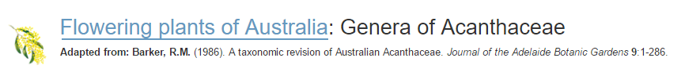

**Make sure you are logged in to KeyBase and are a registered Contributor for the project (see *Registering for KeyBase, and becoming a Contributor* on page 8 for more information).**

1. On the Home page, click *Create new key*:

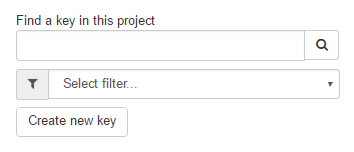

2. Fill in the relevant fields on the metadata page that follows:

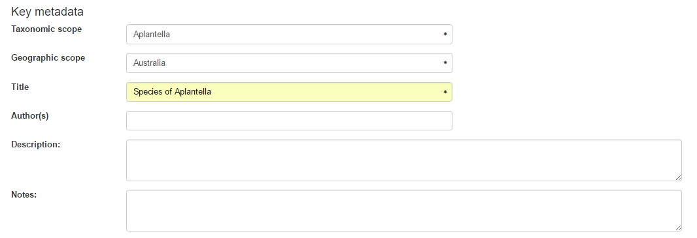

> Note: fields marked with an asterisk are mandatory.

**Taxonomic scope** is the taxon (family, genus, species etc.) that the key is for.

**Geographic scope** is the area for which the key is relevant. For the *Flowering Plants of Australia* project this will always be "Australia".

**Title** is any suitable title for your key. By convention in the *Flowering Plants of Australia* project, and to maintain consistency with other keys, the title should be of the form "Genera of \<family f\>", "Species of \<genus g\>", "Subspecies of \<species s\>" etc.

If this is a new key that you have written, enter your name(s) in **Author(s)** in the form "Surname1, A.B.; Surname2, C.D."

If you wish you can write a description of the key, and any useful notes, in the remaining fields. These are not mandatory.

3. If your key is not newly created, but has been copied from a published source, use the **Source** fields


If this is a new source, click the *Add* button () to create a new source, and fill out the bibliographic fields in the resulting popup.

If you have previously entered a source, start typing a reference (commencing with the author(s) name(s)) into the **Source** box. KeyBase will respond with a list of available sources. Having chosen a source that matches exactly, you may edit the source's details by clicking the **Edit** button ().

4. Browse to the key by clicking on the *Load file* button:

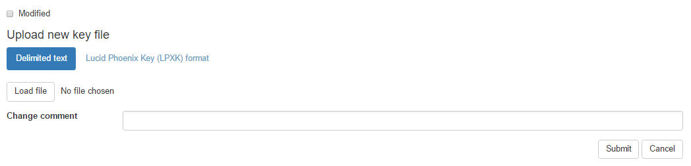

Since this is a new key in KeyBase, leave the *Modified* checkbox unchecked, and leave the *Change comment* blank. Click *Submit* to load the key.

5\. KeyBase will respond with a page where you can check that the key is correct and as expected:

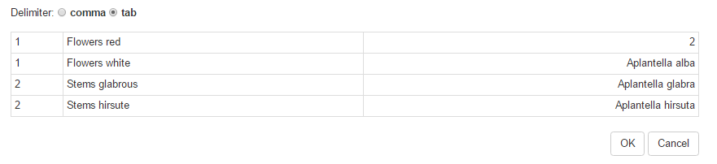

> Note: If there are errors in the key, such as leads that lead nowhere or couplets that are not referenced, a warning bar will specify the errors. Cancel the upload (located at bottom right of page), fix the key, and upload it again.

### Editing an existing KeyBase key

Editing of KeyBase keys is currently done offline, by downloading the key, editing it, and reuploading it. Note that while anyone can download a key, only Contributors to KeyBase can re-upload, and then only if they are assigned as the owner of the key (see *Registering for KeyBase, and becoming a Contributor* on page 8 for more information).

To download a key, use the key's *About* tab and choose the *Export* option. The buttons below provide options for the export format. These *Guidelines* will assume that you're downloading in TXT (Tab-delimited Text) format.

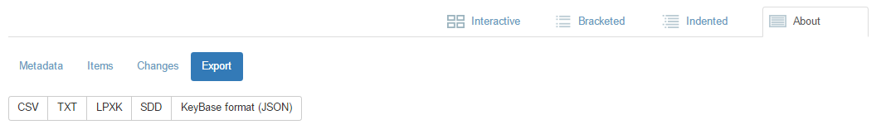

A downloaded key in TXT format will be structured in the same way as the example keys discussed above (see *Writing* and *Uploading a new key to KeyBase* on pages\... ).

If you simply need to edit the key without changing its structure (e.g. correcting a spelling error, adding to a lead, changing the name of a taxon), simply make the edit and re-upload the key (see *Re-uploading an edited key* below).

If you need to make modifications to the key, you will need to decide whether to simply rewrite it from scratch (see *Writing* and *Uploading a new key to KeyBase, on pages* \....), or edit it.

Editing the structure of a key is made easier by the way KeyBase handles couplet numbering. Couplet numbering needs to follow three simple rules (every couplet must have two or more leads; every lead must goto a numbered couplet or terminate in a taxon name; every couplet, except the first, must be referred to by a goto); however, as long as these rules are followed, couplet leads do not need to be in any particular order. Couplet numbers are used when KeyBase parses the key, but are then discarded.

As an example, consider the following key:

If you need to add a new couplet at the head of the key, you can do so using any available number. For example, you may edit the key to:

You can even use negative numbers if necessary. Similarly, if you need to interpolate a couplet, you can add it to the end using any valid number, e.g.:

Or, you can insert it, if that's more convenient for your editing, e.g.:

When KeyBase parses the key, it will rearrange the couplets into a sensible order. This helps when editing keys, because there is no need to manually renumber subsequent couplets if you want to insert a couplet.

### Re-uploading an edited key

Once you've edited your key and saved it, you can re-upload it to KeyBase.

To re-upload, go to the Edit tab:


If the metadata for the key has not changed, leaving everything as it is, go to the end of the window:

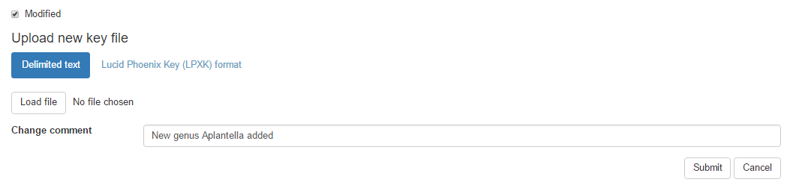

Follow these steps:

1.  If the "Modified" checkbox is unchecked, check it to indicate that the key has now been modified from its original (e.g. published) version;

2.  Click the *Load file* button and browse for the edited key;

3.  Add a suitable comment in the *Change comment* field to indicate the change(s) you've made; and

4.  Click *Submit*.

The new key will now overwrite the old one.

### Deleting a KeyBase key

To delete a key from KeyBase, go to the Home page for the project and find the key either under the *Tree* or the *List* tab (hint: you can search for a tree under either tab using the Search box on the left).

-   In the *Tree* tab, right-click on the key and choose *Delete key* from the popup menu

-   In the *List* tab, click the *Delete* button to the right of the key.

> **(Remember that you can only delete a key if you are registered with KeyBase, have been assigned as a Contributor to the project to which the key belongs, are logged in, and are the owner of the key. See *Registering for KeyBase, and becoming a Contributor* for more information.)**

### Uploading keys obtained from literature

Keys that are available in the literature need to be uploaded to KeyBase in one of the standard formats KeyBase accepts. For relatively small keys, manual editing using a text editor or MS-Word is usually relatively straightforward.

If the key is available in pdf format (e.g. from a journal's website), you may be able to copy and paste the text from a pdf viewer such as Adobe Acrobat into a text file. Some journals protect their pdf from copy and paste, but most do not. Be aware that if the key is printed over several pages, a copy and paste from pdf may include page headers, footers, numbering etc. These will need to be edited out.

If the key is only available in hardcopy, or the pdf does not support copy and paste, you will need to process an image of the key using OCR (Optical Character Recognition). There are many free OCR tools available on the web. Search using Google for e.g. "Free OCR conversion"[^2]. A converter will usually accept a pdf or image file of the document, will process it using OCR, and will return a MS-Word or text file of the converted text. Note that OCR is rarely perfect. You should proof-read the returned file carefully and correct any OCR errors.

If the key you have scanned or copied and pasted is in coupleted format, you may need to do very little editing to get it into the form required for upload to KeyBase. Usually this involves:

-   ensuring that there is a tab between the couplet number and lead text, and another between the lead text and goto;

-   joining any leads that are split across several lines, to ensure that every lead comprises a single line[^3];

-   closing any gaps or spaces between couplets;

-   ensuring that all taxa in the key comprise complete taxon names (e.g. expanding genus contractions to the full genus name).

If the key is in indented format, you will need to add gotos at the end of each lead. This is usually straightforward as the goto will be the couplet number of the next lead.

Remember that the order of leads is immaterial to KeyBase. Thus, the native ordering of couplets in both coupleted keys and indented keys is fine, as long as all leads are correctly numbered.

###  Examples and exercises

The following keys can be used to practice editing and uploading keys to the *Flora of Australia Sandbox* project in KeyBase (see <http://keybase.rbg.vic.gov.au/projects/show/28>).

1. Upload the following key (to the genera of Aizoaceae in Australia). It's presented here in a suitable KeyBase format, so the key itself shouldn't need to be edited before uploading. The source of the key is Prescott, A. & Venning, J. (1984). Aizoaceae. In: *Flora of Australia* 4: 19--62 (Australian Biological Resources Study: Canberra).

```
1,"Petal-like staminodes present",2
1,"Petal-like staminodes absent",13
2,"Placentation axile",3
2,"Placentation parietal or basal",5
3,"Sepals 4","Aptenia {Aptenia cordifolia}"
3,"Sepals 5",4
4,"Plants conspicuously papillose; if leaves caducous, leaf-bases not persisting",Mesembryanthemum
4,"Plants minutely papillose; leaf laminae caducous, the leaf-bases persisting","Psilocaulon {Psilocaulon granulicaule}"
5,"Fruit fleshy, indehiscent",6
5,"Fruit a capsule",7
6,"Styles 7-16",Carpobrotus
6,"Styles 4 or 5",Sarcozona
7,"Capsule dehiscing when dry","Conicosia {Conicosia pugioniformis subsp. muirii}"
7,"Capsule hygroscopic, dehiscing when wet",8
8,"Plants annual",9
8,"Plants perennial",10
9,"Ovary with 12-20 locules","Carpanthea {Carpanthea pomeridiana}"
9,"Ovary with 5, rarely 4, locules",Cleretum
10,"Leaves densely papillose, clavate","Drosanthemum {Drosanthemum candens}"
10,"Leaves smooth, clavate or triquetrous",11
11,"Placental tubercle none",Lampranthus
11,"Placental tubercle present",12
12,"Plants prostrate, rooting at nodes","Disphyma {Disphyma crassifolium subsp. clavellatum}"
12,"Plants erect","Ruschia {Ruschia geminiflora}"
13,"Fruit indehiscent",Tetragonia
13,"Fruit dehiscent",14
14,"Fruit opening by slits or valves",15
14,"Fruit a circumsciss capsule",17
15,"Leaves opposite",Gunniopsis
15,"Leaves alternate",16
16,"Stamens numerous; perianth segments c. 10 mm long","Aizoon {Aizoon rigidum}"
16,"Stamens 10; perianth segments 2–3 mm long",Galenia
17,"Bracts absent","Sesuvium {Sesuvium portulacastrum}"
17,"Bracts associated with flowers",18
18,"Ovary 1-locular",Trianthema
18,"Ovary 2-locular","Zaleya {Zaleya galericulata}"
```

2. Some of the genera in the key above are monotypic. Using the curly brace format, add the species names for one or more of the following taxa, and re-upload the key:

*Aptenia cordifolia*

*Psilocaulon tenue*

*Conicosia bijlii*

*Carpanthea pomeridiana*

*Micropterum papulosum*

*Drosanthemum candens*

*Disphyma crassifolium*

*Ruschia tumidula*

*Sesuvium portulacastrum*

*Zaleya galericulata*

3. The following key, to species of *Gunniopsis*, is in indented format. Note that you'll need to edit the key to make it suitable for KeyBase (number the couplets and gotos, ensure the correct number of tabs between elements of each lead, and globally expand the genus names). When you add the key to the sandbox, ensure that it gets correctly added as a linked key to *Gunniopsis* in the key to genera of Aizoaceae. The source for the key is Venning, J. (1984). *Gunniopsis*. In: *Flora of Australia* 4: 19--62 (Australian Biological Resources Study: Canberra).

Stamens 4-12

Leaves oblong; perianth lobes green inside

Valves of capsule bifid; seeds white, brown on radicular edge *G. septifraga*

Valves of capsule simple; seeds light brown *G. rubra*

Leaves linear, perianth lobes white or pink inside *G. propinqua*

Stamens 30 or more

Capsule dehiscing septicidally and also partly loculicidally; valves bifid

Leaves terete, or flattened only near base

Leaves and stems densely pubescent *G. quadrifida*

Leaves and stems glabrous *G. tenuifolia*

Leaves flat

Leaves lanceolate; stems and leaves covered with peltate scales *G. calcarea*

Leaves spathulate, ovate or linear; if stems and leaves pubescent, trichomes not peltate scales

Plant with well-developed fleshy taproot; stems rarely branched; flowers solitary, terminal *G. glabra*

Plant without fleshy taproot, stems much-branched; flowers in cymes

Perennial, densely pubescent *G. zygophylloides*

Ephemeral, glabrous

Papillae sparse on leaves and branchlets or absent

Perianth yellow inside *G. intermedia*

Perianth white inside

Seeds club-shaped, dark brown or black; WA species *G. rodwayi*

Seeds oblong, light brown; S.A. species *G. calva*

Papillae many on leaves and branchlets, sometimes lacking on lower branchlets

Perianth yellow or white inside *G. papillata*

Perianth pink inside *G. kochii*

Capsule dehiscing septicidally; valves simple *G. divisa*

4\. Imagine that you've described a new species of *Gunniopsis*, segregated from *G. propinqua* and differing in having smooth seeds (seeds in *G. propinqua* are colliculate). Download the key from KeyBase, edit it, and re-upload with this change.

[^1]: The *Australasian Virtual Herbarium* (<http://avh.chah.org.au/>) is a great resource for obtaining checklists of taxa known to occur in areas within Australia.

[^2]: Disclaimer: Be aware of the need for internet security when using free websites such as OCR converters

[^3]: Editing keys in a text editor such as Notepad++ (available free from <https://notepad-plus-plus.org/>) is usually better than editing in MS-Word, since the latter word-wraps by default and it is harder to check that all leads comprise a single line of text.
